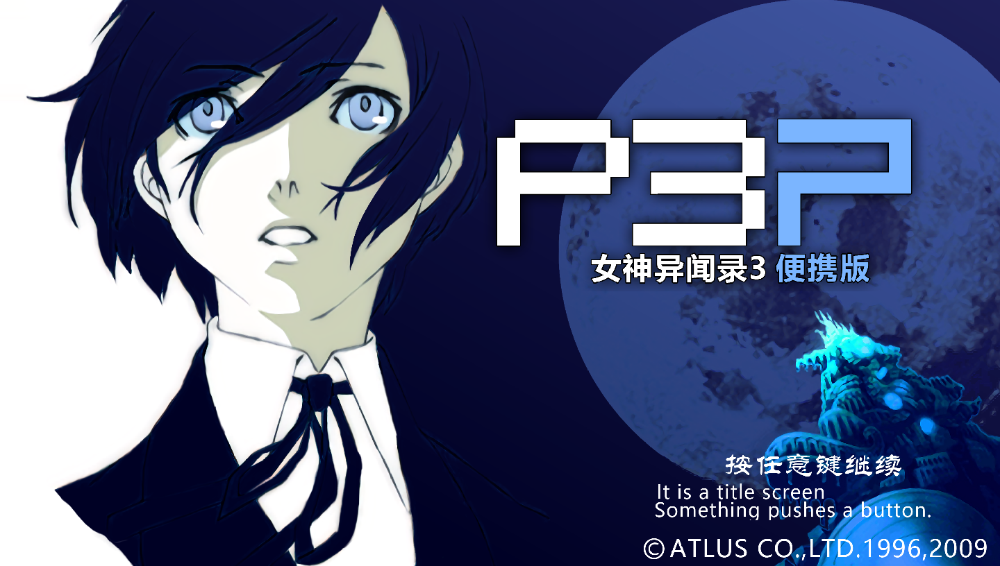
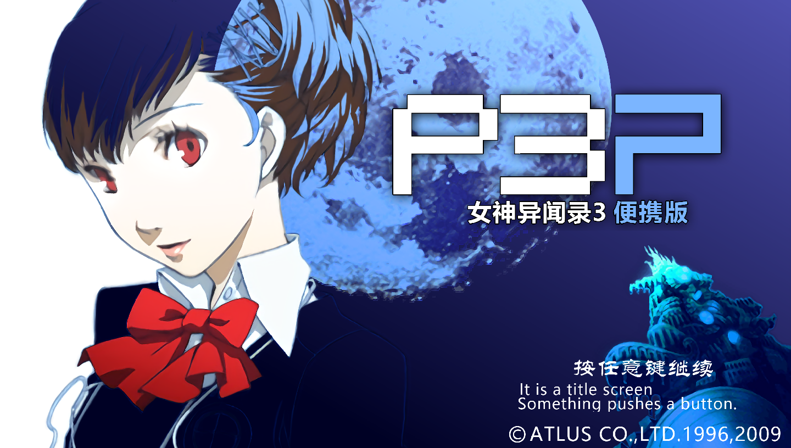
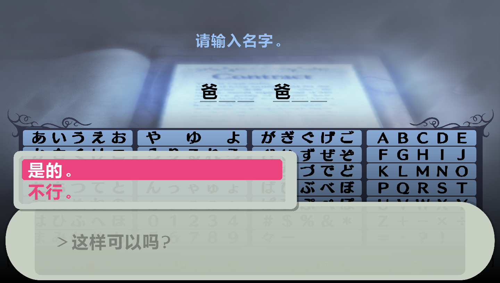
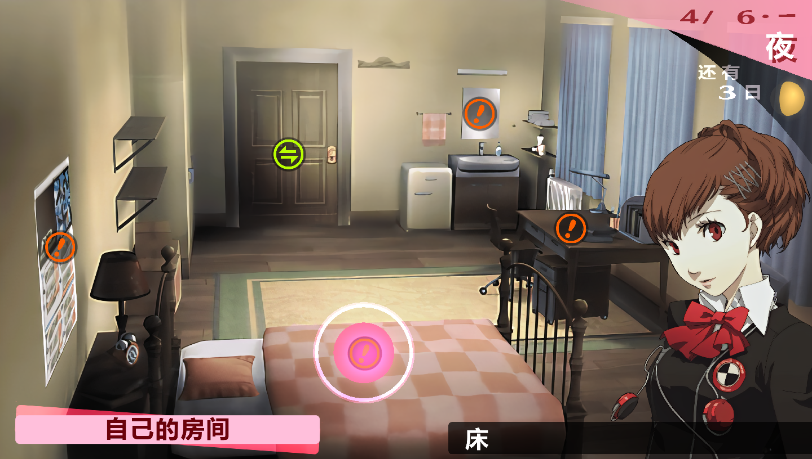
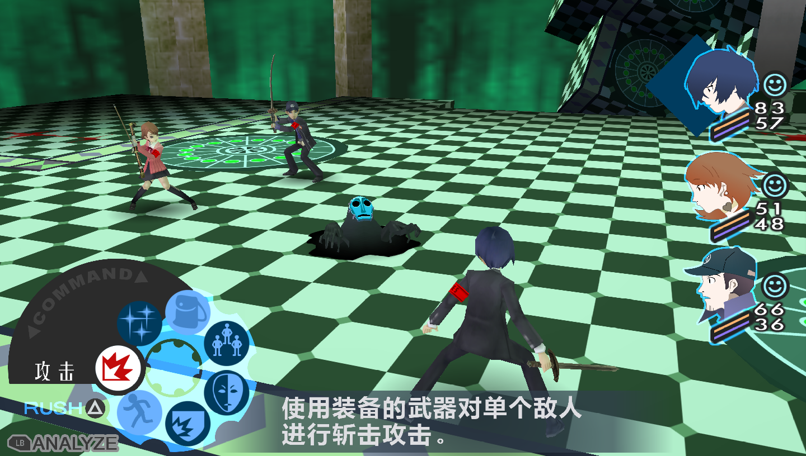
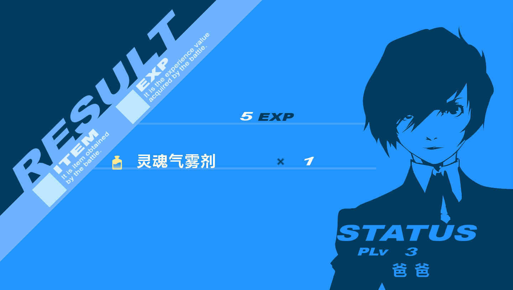
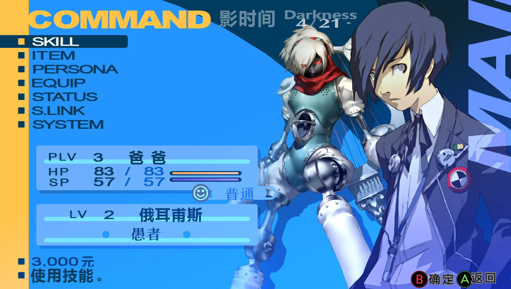

# P3P高清中文材质
## A HD texture(Chinese) replacement for P3P via PPSSPP

***女朋友想试下P3P 发现PPSSPP论坛有大佬做了美版P3P的高清材质 又发现英文版完全没内味儿 于是想着帮女朋友移植一个汉化版的***

> 开了坑才发现素材替换很简单，但是字体素材裂开了

> 美版素材替换逻辑：贴图全换了 26个字母换成高清的 完事儿 贴图简单 字体！？
> 问题就来了，中文汉字儿那么多 都得一个一个做成贴图替换 这坑估计得很久

## 截图

## 食用方法：
* 下载 美版素材包（ULUS10512） 在PPSSPP的记忆棒内容文件夹内新建`TEXTURES/NPJH50040`文件夹，如果没有`TEXTURES`需要新建一个
* 下载最新版本的汉化高清素材，复制到刚才的文件夹中覆盖
* 回应[山雨lou](https://space.bilibili.com/5002935)更新了手柄配置。若为XBOX手柄，无需更改。若为Sony的Dualshock手柄，将目录下的`PS_BUTTONS.zip`内的文件复制替换到`TEXTURES/NPJH50040`下即可。
* 打开PPSSPP 在设置中 找到`工具/开发者工具`，勾选纹理替换 ，加载P3P汉化版即可
[美版素材+美版镜像+汉化版镜像(百度网盘)](https://pan.baidu.com/s/1j610nAeDjzmOPbl2TOGTEA?pwd=kkgo) 提取码 `kkgo`
### 暂时还有很多没有完成高清化的内容，慢慢等更新吧
### 如果可以，请在开发者工具中勾上`保存新纹理`，遇到许多模糊的字体后，将`TEXTURES/NPJH50040/new`文件夹打包发给我
### 若发现有错别字，请提交issue 并告知：错别字，应为何字，完整语句

* **目前进度**  2022年6月19日15:30:49
 * ***v0.10***
 * 汉字：3079个
 * 菜单UI：完成
 * 战斗UI：大部分
 * 感谢[初见真身](https://space.bilibili.com/296884220)的测试帮助！
 * 感谢B站网友**StoneJia83**的测试支持

我的邮箱是`mabinsoft@vip.qq.com`
